# Atividade: Finalizando o System Auth

ViaCEP + Login com Google (OAuth 2.0)

Projeto com back-end em Node.js/Express (MySQL, JWT, bcrypt) e front-end em React + Vite.

---

## Parte 1: Glossário do Login com Google (OAuth 2.0)

### Back-end

#### 1. google-auth-library
- **O que é:** biblioteca oficial do Google para Node.js (criada e mantida pelo Google, instalada pelo npm) que trabalha com autenticação e validação de tokens.
- **Para que serve no projeto:** verificar se o token que chegou do front foi mesmo emitido pelo Google. Ela fica no back-end porque o front pode ser alterado por qualquer pessoa; a validação precisa rodar em um lugar que o usuário não controla.
- **Onde aparece:** `back/controllers/userControllers.js` (`import { OAuth2Client } from 'google-auth-library'`) e no `package.json` do back.

#### 2. OAuth2Client
- **O que é:** classe da biblioteca que representa a nossa aplicação perante o Google.
- **Para que serve no projeto:** criamos com `new OAuth2Client(process.env.GOOGLE_CLIENT_ID)` para ele saber quem somos e conseguir validar tokens emitidos para o nosso Client ID.
- **Onde aparece:** `userControllers.js`, no topo do arquivo (`googleClient`), usado na função `loginGoogle`.

#### 3. verifyIdToken()
- **O que é:** método do `OAuth2Client` que valida um ID Token.
- **Para que serve no projeto:** confere a assinatura do token (com as chaves públicas do Google), a validade (expiração), o emissor e o `audience`. Se o token for falso, adulterado ou expirado, a função lança um erro: o `catch` do `loginGoogle` responde **401** e nenhum usuário é lido ou criado no banco.
- **Onde aparece:** `userControllers.js`, função `loginGoogle`.

#### 4. credential (ID Token)
- **O que é:** um JWT assinado pelo Google que contém os dados do usuário que fez login.
- **Para que serve no projeto:** é a prova de identidade. Ele é gerado pelo Google depois que o usuário escolhe a conta no popup; o nosso front apenas recebe e repassa para o back-end.
- **Onde aparece:** no front, em `Login.jsx` (`credentialResponse.credential`, enviado no `POST /users/login/google`); no back, em `loginGoogle` (`const { credential } = req.body`).

#### 5. audience
- **O que é:** parâmetro do `verifyIdToken` que indica para quem o token foi emitido (campo `aud` do JWT).
- **Para que serve no projeto:** garante que o token foi emitido para o **nosso** aplicativo. Sem isso, um token válido emitido para outro aplicativo qualquer seria aceito pelo nosso back-end. Por isso o Client ID aparece de novo na verificação.
- **Onde aparece:** `loginGoogle`: `audience: process.env.GOOGLE_CLIENT_ID`.

#### 6. getPayload()
- **O que é:** método do ticket devolvido pelo `verifyIdToken`.
- **Para que serve no projeto:** devolve o conteúdo já verificado do token. Quatro campos: `sub`, `email`, `email_verified` e `name` (também vêm `picture`, `iss`, `aud`, `exp`).
- **Onde aparece:** `loginGoogle`: `const dadosGoogle = ticket.getPayload()`.

#### 7. sub
- **O que é:** identificador único do usuário dentro do Google (*subject*).
- **Para que serve no projeto:** é permanente e nunca é reaproveitado para outra pessoa. O e-mail pode mudar ou ser reatribuído, então o `sub` é mais seguro para reconhecer o mesmo usuário. Ele é guardado na coluna `google_id` da tabela `users`.
- **Onde aparece:** `loginGoogle` (`dadosGoogle.sub`, no `SELECT`, `UPDATE` e `INSERT`) e na coluna `google_id` do banco.

#### 8. email_verified
- **O que é:** campo booleano do payload que indica se o Google confirmou que a pessoa é dona daquele e-mail.
- **Para que serve no projeto:** se for `false`, alguém poderia informar um e-mail que não é seu e acessar ou criar uma conta em nome de outra pessoa. Por isso o login é recusado (401). Isso é ainda mais importante porque o nosso código vincula o `google_id` a uma conta local que tenha o mesmo e-mail.
- **Onde aparece:** `loginGoogle`: `if (!dadosGoogle.email_verified)`.

#### 9. Nosso JWT (gerarToken)
- **O que é:** token que a nossa API assina com o nosso segredo (`JWT_SECRET`), com `id`, `username` e `role`, e expiração de 2h por padrão.
- **Para que serve no projeto:** o token do Google só prova a identidade no momento do login. Geramos o nosso para ter um único formato de sessão, igual para o login com senha e com Google, com os nossos dados e a nossa expiração. Assim o middleware valida apenas um tipo de token.
- **Onde aparece:** função `gerarToken` em `userControllers.js` (usada em `login` e `loginGoogle`) e o middleware `back/middleware/auth.js`, que valida o token nas rotas `/perfil` e `/endereco`.

### Front-end

#### 10. @react-oauth/google
- **O que é:** biblioteca React que encapsula o Google Identity Services (botão, popup de escolha de conta). **Não é oficial do Google**: é mantida pela comunidade, embora use a tecnologia oficial do Google.
- **Para que serve no projeto:** evita integrar o script do Google manualmente e fornece os componentes `GoogleOAuthProvider` e `GoogleLogin` e a função `googleLogout`.
- **Onde aparece:** `front/package.json` e os imports em `main.jsx`, `Login.jsx` e `Dashboard.jsx`.

#### 11. GoogleOAuthProvider
- **O que é:** um *Provider* do React: componente que usa a Context API para disponibilizar dados a todos os componentes que estão dentro dele.
- **Para que serve no projeto:** carrega o script do Google e entrega o `clientId` aos componentes filhos. Ele envolve o `<App />` para que qualquer tela possa usar o `GoogleLogin` sem receber o ID por props. Sem ele, o `GoogleLogin` dá o erro "must be used within GoogleOAuthProvider".
- **Onde aparece:** `front/src/main.jsx`.

#### 12. clientId / VITE_GOOGLE_CLIENT_ID
- **O que é:** identificador **público** da nossa aplicação no Google.
- **Para que serve no projeto:** diz ao Google qual aplicação está pedindo o login. Pode ficar no front porque sozinho não dá acesso a nada (ele aparece nas requisições do navegador de qualquer forma). O **Client Secret** é uma credencial privada de servidor e nunca pode ir para o navegador. O prefixo `VITE_` é o que faz o Vite expor a variável ao código do front.
- **Onde aparece:** `.env` do front (`VITE_GOOGLE_CLIENT_ID`), lido em `main.jsx` com `import.meta.env.VITE_GOOGLE_CLIENT_ID`.

#### 13. GoogleLogin
- **O que é:** componente do botão "Fazer Login com o Google".
- **Para que serve no projeto:** ao clicar, abre o popup do Google para o usuário escolher a conta e autorizar. Depois o Google devolve o `credential` para o nosso código.
- **Onde aparece:** `front/src/pages/Login/Login.jsx`.

#### 14. onSuccess / onError
- **O que são:** callbacks (props) do `GoogleLogin`.
- **Para que servem no projeto:** o `onSuccess` roda quando o login no Google dá certo e recebe o `credentialResponse` (o token está em `credentialResponse.credential`); então enviamos o `credential` para `POST /users/login/google`. O `onError` roda quando o login falha ou o usuário fecha o popup, e não recebe dados; usamos para mostrar uma mensagem de erro.
- **Onde aparece:** props do `<GoogleLogin />` em `Login.jsx` (`handleGoogleSuccess` e `handleGoogleError`).

#### 15. googleLogout()
- **O que é:** função da biblioteca que encerra a sessão do lado do Google.
- **Para que serve no projeto:** limpar o `localStorage` encerra só a nossa sessão. Sem o `googleLogout()`, o Google pode continuar com a conta selecionada automaticamente e entrar de novo sozinho na próxima visita.
- **Onde aparece:** `front/src/pages/Dashboard.jsx`, na função `sair` do botão "Sair".

---

## Parte 2: Integração

### Etapa 1: Rotas (back-end)

Em `back/routes/userRoutes.js` foram importadas as funções novas do controller e criadas as rotas:

- `POST /users/login/google` (pública)
- `PUT /users/endereco` (protegida com o middleware `verificarToken`, o mesmo do `/perfil`)

**Testes no Thunder Client**

1. Login para obter o token (`POST /users/login`):

   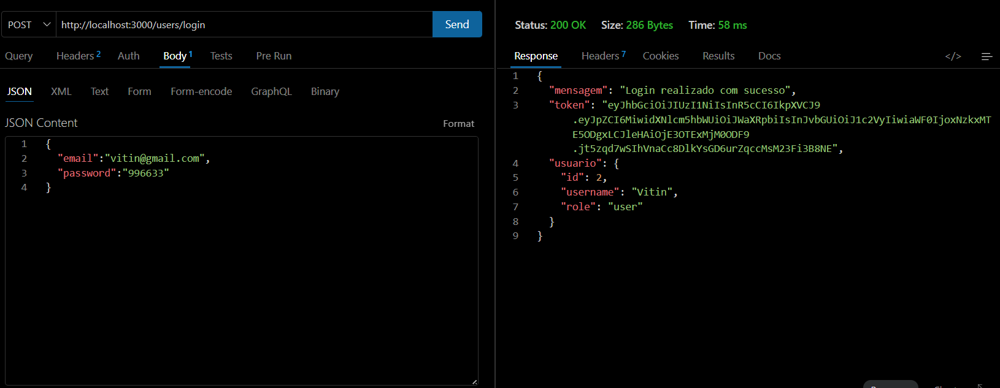

2. `GET /users/perfil` com o token (Bearer). Traz o usuário e o endereço:

   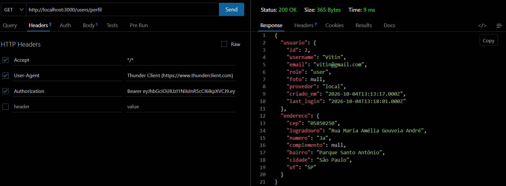

3. `PUT /users/endereco` com um endereço novo:

   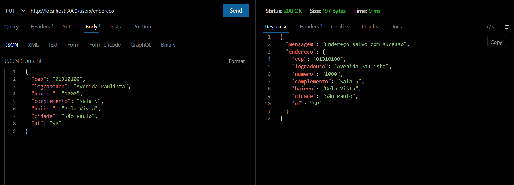

4. `GET /users/perfil` de novo, com o endereço novo:

   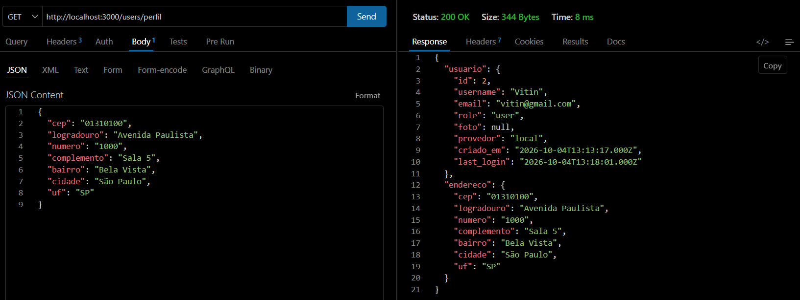

**O endereço foi atualizado ou foi criado outro? Por quê?**

Foi **atualizado**. O mesmo usuário (id 2) passou do CEP `05850250` para `01310100`, e continua com um único endereço. Isso acontece porque a coluna `usuario_id` da tabela `enderecos` é `UNIQUE`: quando o `INSERT` tenta criar um segundo endereço para o mesmo usuário, o `ON DUPLICATE KEY UPDATE` troca os valores da linha que já existe em vez de inserir outra.

### Etapa 2: Enviar o token automaticamente

Em `front/src/api.js` foi criado um interceptor do Axios que, antes de cada requisição, lê o token do `localStorage` e coloca no cabeçalho `Authorization: Bearer <token>`.

### Etapa 3: ViaCEP

**3.1 Serviço de busca:** `front/src/services/viacep.js` com a função `buscarCep(cep)`: remove tudo que não é número, faz `fetch` em `https://viacep.com.br/ws/CEP/json/`, lança o erro "CEP não encontrado" quando a resposta traz `erro`, e devolve `cep`, `logradouro`, `bairro`, `cidade` e `uf` (o ViaCEP chama a cidade de `localidade`; o nosso banco usa `cidade`).

**Por que `fetch` e não o `api` do Axios?** O `api` tem a `baseURL` do nosso back-end (`http://localhost:3000/users`) e, com o interceptor da Etapa 2, enviaria o nosso token JWT em toda requisição, inclusive para um site de terceiros. O `fetch` evita as duas coisas.

**3.2 Tela de Cadastro:** o estado `endereco` e os campos ficam no componente `FormEndereco.jsx` (Extra da atividade), que recebe `endereco` e `setEndereco` por props. Quando o CEP chega a 8 números, chama `buscarCep` e preenche logradouro, bairro, cidade e UF. O `Cadastro.jsx` envia o endereço junto: `api.post('/cadastro', { username, email, password, endereco })`.

Cadastro com o CEP preenchido automaticamente (CEP `01310100`: logradouro, bairro, cidade e UF vieram do ViaCEP; o número é digitado pelo usuário):

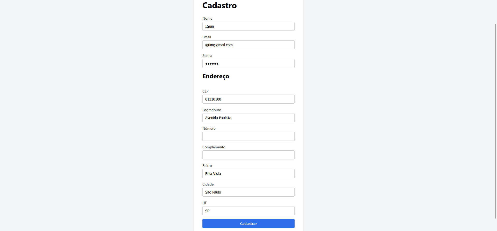

### Etapa 4: Login com Google

- **4.1** Instalado com `npm install @react-oauth/google`.
- **4.2** `VITE_GOOGLE_CLIENT_ID` no `.env` do front.
- **4.3** `GoogleOAuthProvider` envolvendo o `<App />` em `main.jsx`.
- **4.4** Botão `GoogleLogin` na tela de login; o `onSuccess` envia o `credential` para `POST /users/login/google`, e a função `finalizarLogin(dados)` (usada pelos dois logins) salva o token e o usuário no `localStorage` e vai para o dashboard.
- **4.5** `googleLogout()` chamado no botão Sair do Dashboard.

Tela de login com o botão do Google:

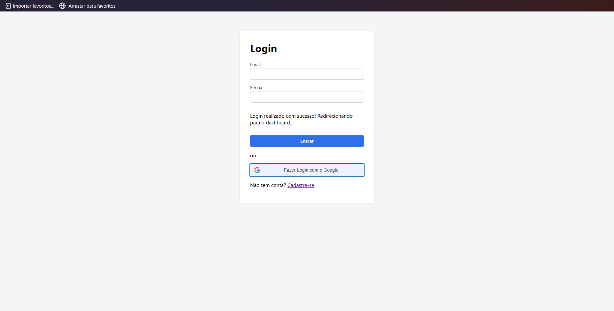

**Testes**

- Entrar com o Google: usuário novo aparece no banco com `provedor = 'google'` e `password = NULL`.

  Banco de dados com um usuário `google` (sem senha, `password = NULL`) e um `local` (com senha criptografada):

  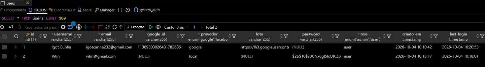

- Login com senha usando o e-mail da conta criada pelo Google: o back-end encontra o usuário, vê que `password` é `NULL` e responde **400** com a mensagem: *"Esta conta foi criada com o Google. Use o botão 'Entrar com Google'"*.

  Mensagem exibida na tela de login:

  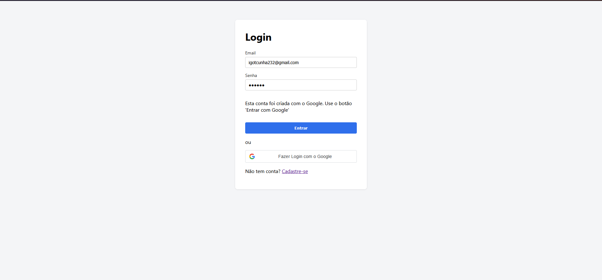

### Desafio: Meus dados no Dashboard

O componente `MeusDados.jsx` chama `GET /perfil` e mostra nome, e-mail, foto e endereço. O estado `dados` começa como `null` até o `/perfil` responder, por isso o componente usa `?.` (`dados?.usuario?.username`, `dados?.endereco`). Quem não tem endereço (como quem entrou pelo Google) vê o formulário para cadastrar, que usa o `PUT /endereco`; quem já tem endereço usa o botão "Editar endereço".

Usuário logado com o Google, vendo seus dados e endereço:

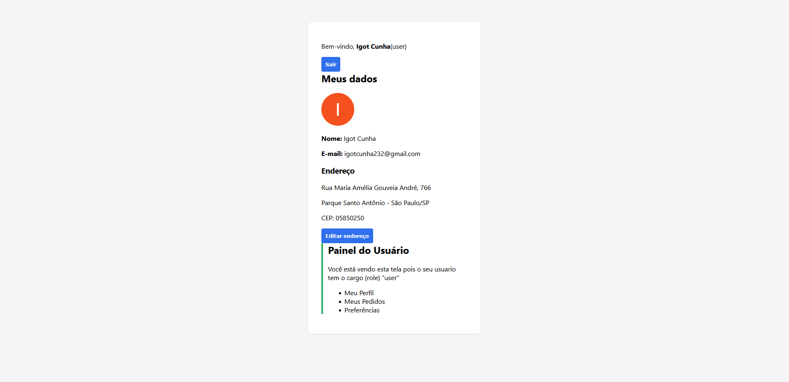

Editando o endereço (campos preenchidos, incluindo o CEP novo):

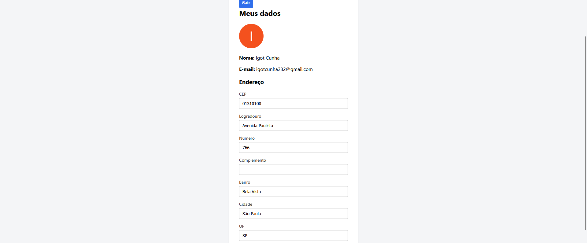

Depois de salvar, o endereço novo aparece na tela:

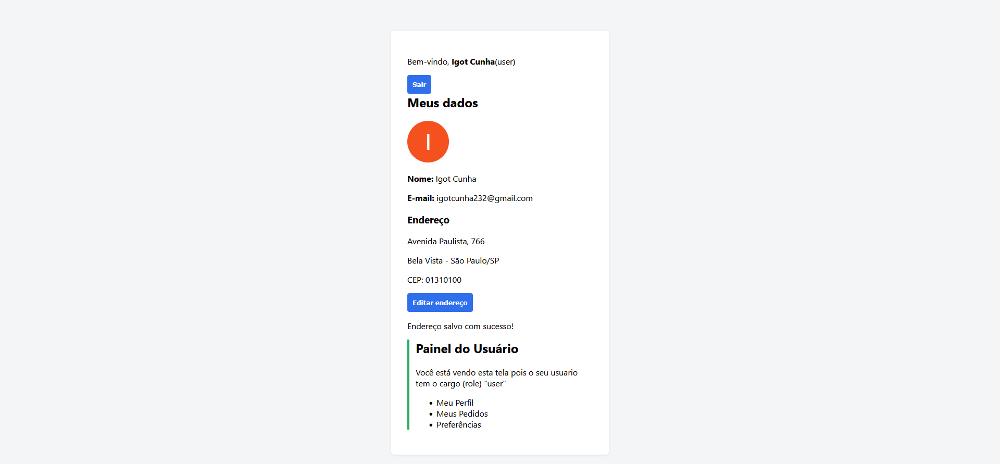

---

## Como rodar

**Back-end** (`.env`): `GOOGLE_CLIENT_ID`, `JWT_SECRET`, `JWT_EXPIRES_IN` e as variáveis de conexão com o MySQL.

**Front-end** (`.env`): `VITE_API_URL=http://localhost:3000/users` e `VITE_GOOGLE_CLIENT_ID`.

Em cada pasta: `npm install` e depois `npm run dev` (ou o script de start do back). Os arquivos `.env` não vão para o repositório.

## Link do repositório

(colar aqui o link do GitHub)
